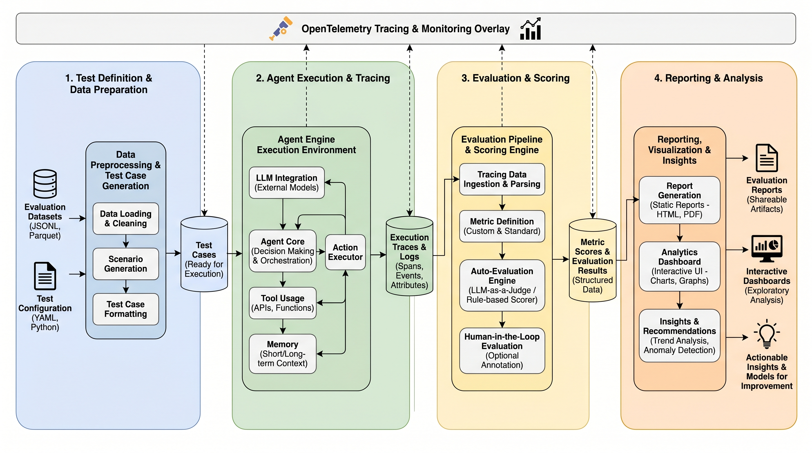
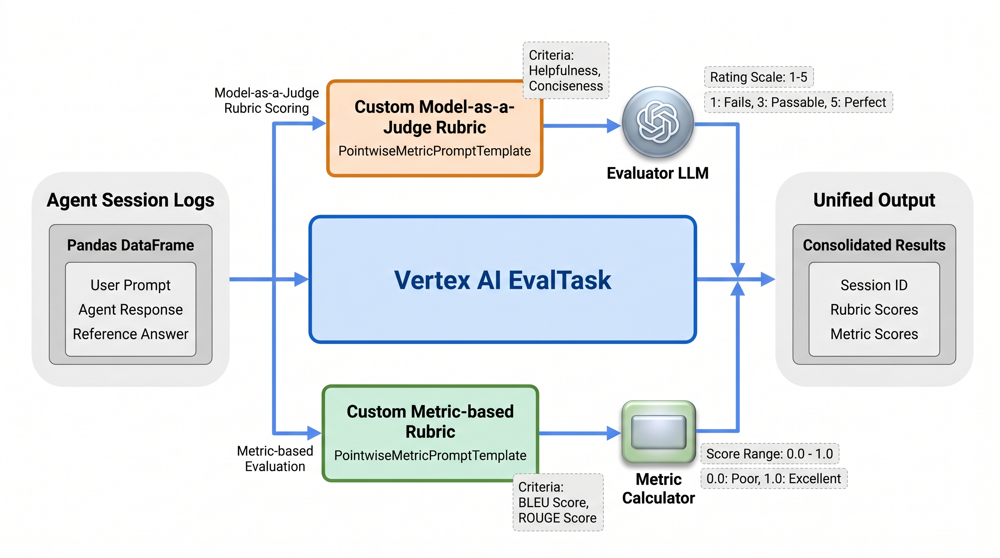
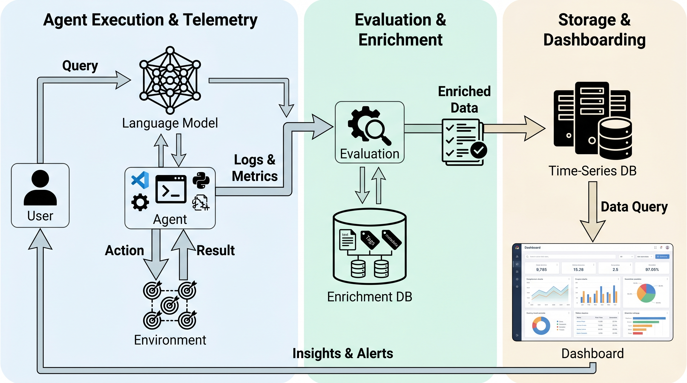
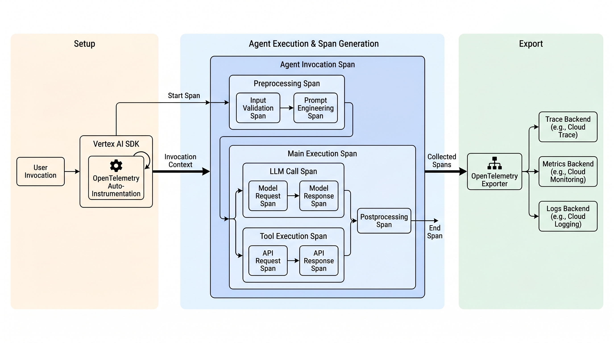

# Agent Engine: Evaluation & Observability Patterns

> Two architecture patterns for deploying, evaluating, and monitoring AI agents on Vertex AI Agent Engine — from custom Cloud Run evaluation pipelines to native Agent Runtime monitoring.

This repository demonstrates two complementary patterns for agent evaluation on [Vertex AI Agent Engine](https://cloud.google.com/vertex-ai/docs/generative-ai/agent-engine):

| | Pattern 1: Cloud Run | Pattern 2: Agent Runtime |
|:---|:---|:---|
| **Whitepaper** | [`docs/pattern1_cloud_run.md`](docs/pattern1_cloud_run.md) | [`docs/pattern2_agent_runtime.md`](docs/pattern2_agent_runtime.md) |
| **Agent Framework** | `ReasoningEngine` class | ADK `Agent` + `AdkApp` |
| **Evaluation** | Custom Model-as-a-Judge rubrics (on-demand) | Online Monitors (automated, every 10 min) |
| **Metrics** | Custom `PointwiseMetric` (1-5 scale) | 4 predefined metrics (0.0-1.0 scale) |
| **Tracing** | OTEL via env vars | Native `AdkApp(enable_tracing=True)` |
| **BigQuery Sink** | `pandas-gbq` export | Cloud Logging sink (`online-eval-to-bq`) |
| **Console UI** | Cloud Trace only | Dashboard, Traces, Evaluation tabs |


*Figure 1: Complete pipeline from agent deployment through evaluation to BigQuery/Looker reporting.*

---

## Pipeline Stages

### Stage 1: Agent Definition & Deployment

The agent is defined as a `FinanceAgent` class with two methods:

- **`set_up()`** — Runs once on first deployment. Initializes a `GenerativeModel` using `gemini-2.5-flash`, sets the system prompt ("You are a helpful finance agent focused on Google Cloud billing"), and configures four OpenTelemetry environment variables to enable automatic tracing.
- **`query(prompt)`** — The entrypoint invoked by Agent Engine. Sends the system prompt and user prompt to the Gemini model and returns the generated text.

The agent is deployed to Vertex AI via `reasoning_engines.ReasoningEngine.create()`, which packages the class along with its Python dependencies (`google-cloud-aiplatform`, `google-cloud-bigquery`, `pandas`) and uploads it to a managed runtime. The deployment returns a `resource_name` that serves as the agent's remote endpoint.

**Key files:** [`src/deploy_agent.py`](src/deploy_agent.py) (deployed version with OTel), [`src/agent.py`](src/agent.py) (template reference)

### Stage 2: Traffic Generation

The pipeline queries the deployed agent with test prompts and collects responses. Two representative queries are issued — one about billing account status, one about support ticket creation. The responses are assembled into a pandas DataFrame alongside the original prompts and human-written reference answers, producing a three-column dataset (`prompt`, `response`, `reference`) ready for evaluation.

### Stage 3: Evaluation with Custom Rubrics

Instead of relying solely on naive metrics like BLEU or exact match, the pipeline uses the [Vertex AI Eval](https://cloud.google.com/vertex-ai/docs/generative-ai/eval) service to implement **Model-as-a-Judge** scoring. The `EvalTask` applies two evaluation methods in parallel:

**Custom Rubric (PointwiseMetric):** A `PointwiseMetricPromptTemplate` defines two qualitative criteria:

| Criterion | Definition |
|-----------|------------|
| **Helpfulness** | The response must directly and accurately answer the user's initial request. |
| **Conciseness** | The response must be brief. No rambling or unnecessary pleasantries. |

An evaluator LLM reads each prompt-response pair and assigns a rating on a **1 to 5 scale**:

| Score | Meaning |
|-------|---------|
| 1 | Fails to answer the request entirely. |
| 3 | Answers the request, but contains irrelevant rambling or requires cognitive effort. |
| 5 | Perfect. Accurately and concisely answers the request. |

The evaluator also produces a written `explanation` justifying its score.

**Exact Match (Baseline):** An `exact_match` metric performs algorithmic string comparison against the reference answers, producing a binary 0 or 1 result as a deterministic baseline.


*Figure 2: Evaluation pipeline with custom rubric and baseline metrics.*

**Key file:** [`src/evaluate_and_export.py`](src/evaluate_and_export.py)

### Stage 4: BigQuery Export

The scored results DataFrame is enriched with metadata (`eval_timestamp`, `agent_version`) and exported to BigQuery via [`pandas-gbq`](https://pandas-gbq.readthedocs.io/). The `to_gbq()` function appends data to the destination table, preserving the full history of evaluation runs. Column names containing `/` characters from Vertex Eval output are sanitized by replacing slashes with underscores before export.


*Figure 3: Data flow from evaluation to BigQuery and Looker.*

**BigQuery Schema** (`agent_metrics.eval_rubric_results`):

| Field | Type | Description | Origin |
|-------|------|-------------|--------|
| `eval_timestamp` | TIMESTAMP | Time the evaluation was executed | Pipeline injection |
| `agent_version` | STRING | Tagged release of the Reasoning Engine | Pipeline injection |
| `prompt` | STRING | The initial user query | Agent logs |
| `response` | STRING | The agent's generated output | Agent logs |
| `agent_quality_score` | FLOAT | Model-as-a-Judge score (1–5) | Vertex Eval |
| `explanation` | STRING | Evaluator's justification for the score | Vertex Eval |
| `exact_match` | INT | Baseline comparison (0 or 1) | Vertex Eval |

---

## OpenTelemetry Tracing

Vertex AI Agent Engine provides **automatic, zero-code observability** through OpenTelemetry. When telemetry is enabled, Agent Engine wraps every agent step — reasoning loops, LLM generations, and tool invocations — in OTel spans that are automatically exported to [Google Cloud Trace](https://cloud.google.com/trace).

Four environment variables control the instrumentation (set in `FinanceAgent.set_up()`):

```env
GOOGLE_CLOUD_AGENT_ENGINE_ENABLE_TELEMETRY=true
OTEL_SERVICE_NAME=demo-finance-agent
OTEL_PYTHON_LOGGING_AUTO_INSTRUMENTATION_ENABLED=true
OTEL_INSTRUMENTATION_GENAI_CAPTURE_MESSAGE_CONTENT=true
```

The resulting span hierarchy captures the full agent execution tree:

- **Root span** — entire agent invocation
  - **ReAct reasoning loop** — orchestrates think-act-observe cycles
    - **LLM generation spans** — each Gemini model call with token counts and latency
    - **Tool execution spans** — each tool invocation with arguments, results, and duration

This waterfall visualization lets developers immediately identify bottlenecks: slow LLM inference, slow tool calls, or orchestration overhead — all without writing a single line of tracing code.


*Figure 4: OTel span hierarchy showing automatic agent instrumentation.*

---

## Getting Started

### Prerequisites

- Google Cloud project with [Vertex AI API](https://console.cloud.google.com/apis/library/aiplatform.googleapis.com) enabled
- BigQuery dataset `agent_metrics` created in your project
- Python 3.10+ with [`uv`](https://docs.astral.sh/uv/) package manager
- Application Default Credentials configured (`gcloud auth application-default login`)

### Install Dependencies

```bash
UV_INDEX_URL=https://pypi.org/simple uv sync
```

### Configure Environment

Create an `opentelemetry.env` file in the project root:

```env
GOOGLE_CLOUD_AGENT_ENGINE_ENABLE_TELEMETRY=true
OTEL_SERVICE_NAME=demo-finance-agent
OTEL_PYTHON_LOGGING_AUTO_INSTRUMENTATION_ENABLED=true
OTEL_INSTRUMENTATION_GENAI_CAPTURE_MESSAGE_CONTENT=true
```

### Local Testing

Verify model access and basic agent functionality before deploying:

```bash
uv run python src/test_locally.py
```

### Deploy and Evaluate

Run the full pipeline — deploy agent, generate traffic, evaluate, and export to BigQuery:

```bash
uv run python src/deploy_agent.py
```

### Run Evaluation Standalone

If the agent is already deployed, run evaluation and BigQuery export independently:

```bash
uv run python src/evaluate_and_export.py
```

### Generate Diagrams

Regenerate the architecture diagrams using [paperbanana](https://github.com/paperbanana/paperbanana):

```bash
uv sync --group diagrams
uv run --group diagrams python scripts/generate_diagrams.py
```

---

## Project Structure

```
├── src/
│   ├── deploy_agent.py              # Pattern 2: ADK agent deploy + traffic + eval + BQ export
│   ├── agent.py                     # Agent class template (reference)
│   ├── setup_online_evaluators.py   # Pattern 2: Create online monitors via v1beta1 API
│   ├── manage_online_monitors.py    # Pattern 2: Monitor CRUD + integration test
│   ├── verify_online_monitors.py    # Pattern 2: Verify monitors across 4 signal layers
│   ├── evaluate_and_export.py       # Pattern 1: Standalone eval + BQ export
│   ├── api.py                       # Pattern 1: FastAPI endpoints for query/eval
│   └── whitepaper2_report.html      # Pattern 2: Interactive HTML report
├── docs/
│   ├── pattern1_cloud_run.md         # Pattern 1: Cloud Run whitepaper
│   ├── pattern2_agent_runtime.md     # Pattern 2: Agent Runtime whitepaper
│   └── assets/                      # Screenshots, GIFs, and generated diagrams
├── scripts/
│   └── generate_diagrams.py         # Paperbanana diagram generation
├── paperbanana_inputs/              # Text inputs for diagram generation
├── pyproject.toml                   # Dependencies (uv-managed)
├── opentelemetry.env                # OTel configuration template
└── gemini.md                        # Model compatibility notes
```

## GCP Configuration

| Parameter | Value |
|-----------|-------|
| **Project** | `wortz-project-352116` |
| **Region** | `us-central1` |
| **Model** | `gemini-2.5-flash` |
| **Staging Bucket** | `gs://wortz-project-352116-vertex-staging-us-central1` |
| **BigQuery Table** | `agent_metrics.eval_rubric_results` |

## Further Reading

- [Pattern 1: Cloud Run — Custom Evaluation & BigQuery Reporting](docs/pattern1_cloud_run.md)
- [Pattern 2: Agent Runtime with Native OTEL & Monitors](docs/pattern2_agent_runtime.md)
- [Vertex AI Agent Engine Documentation](https://cloud.google.com/vertex-ai/docs/generative-ai/agent-engine)
- [Vertex AI Evaluation Service](https://cloud.google.com/vertex-ai/docs/generative-ai/eval)
