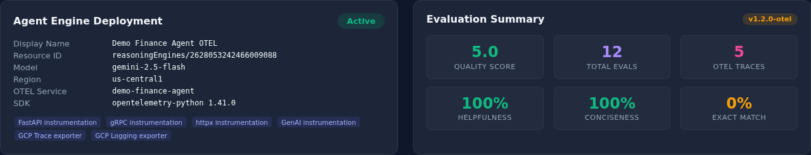
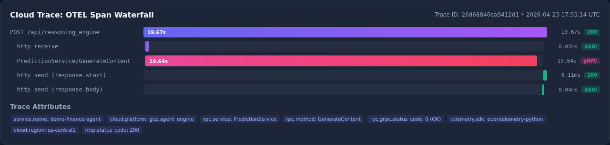
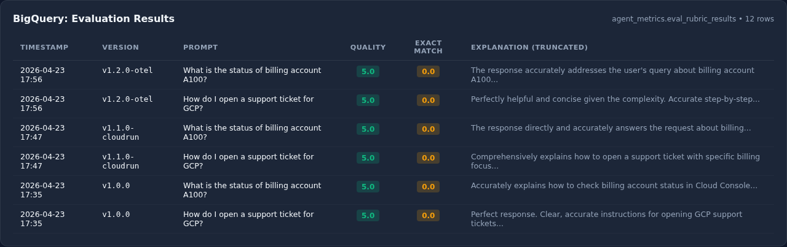
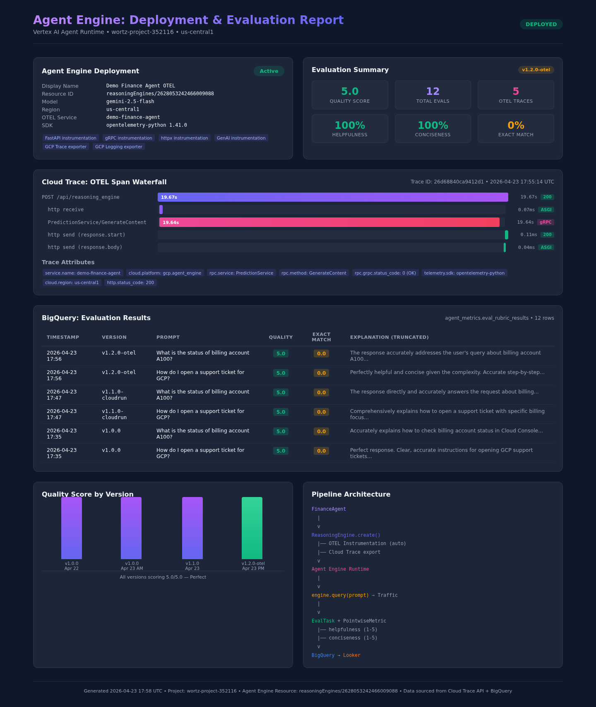

# Pattern 1: Cloud Run — Custom Evaluation & BigQuery Reporting

This document details **Pattern 1** for agent evaluation: deploying a `ReasoningEngine` agent on Vertex AI Agent Engine, scoring it with custom Model-as-a-Judge rubrics via the [Vertex AI Eval](https://cloud.google.com/vertex-ai/docs/generative-ai/eval) service, and sinking results to [BigQuery](https://cloud.google.com/bigquery) for [Looker](https://looker.com/) dashboarding. Operational telemetry is provided out-of-the-box via [OpenTelemetry (OTel)](https://opentelemetry.io/) integration with [Cloud Trace](https://console.cloud.google.com/traces).

> **See also:** [Pattern 2: Agent Runtime with Native OTEL & Monitors](pattern2_agent_runtime.md) — the newer approach using ADK agents, `AdkApp(enable_tracing=True)`, and Online Monitors for continuous automated evaluation.

## Architecture at a Glance

The complete pipeline spans four stages — from agent deployment through evaluation to executive dashboarding — with OpenTelemetry tracing running orthogonally across all stages.


*Figure 1: End-to-end pipeline from agent deployment through traffic generation, evaluation, and BigQuery/Looker reporting.*

---

## 1. Out-of-the-Box Operational Telemetry (OTel)

Vertex AI Agent Engine is inherently designed with observability as a first-class citizen. It automatically wraps agent steps—including ReAct reasoning loops, LLM generations, and tool invocations—in OpenTelemetry (OTel) spans.

Because of the seamless OTel integration, developers don't have to write custom tracing code to monitor the operational data of their agents. The following diagram illustrates the hierarchical span structure that Agent Engine creates automatically when telemetry is enabled:


*Figure 2: OpenTelemetry span hierarchy showing automatic instrumentation of reasoning loops, LLM calls, and tool execution.*

**Key Out-of-the-Box Metrics Available:**
*   **Step-by-Step Latency:** Immediately identify bottlenecks (e.g., distinguishing a Slow API Tool response from pure LLM inference latency).
*   **Token Consumption:** Total tokens processed at each reasoning step are natively emitted as operational logs.
*   **Invocation Counts:** Successful vs. Failed agent turns tracking.

---

## 2. Qualitative Insights: Custom Evaluation Rubrics & Base Evals

While operational telemetry tells you *how fast* the agent is acting, **Evaluation Metrics** tell you *how good* the agent's decisions are. 

Instead of relying solely on exact match base-evals, we use the [Vertex AI Eval](https://cloud.google.com/vertex-ai/docs/generative-ai/eval) service to implement **Model-as-a-Judge** scoring. This pipeline allows you to define qualitative rubrics directly:


*Figure 3: Evaluation pipeline showing custom rubric scoring (helpfulness and conciseness, rated 1-5) alongside exact-match baseline.*

By scoring offline datasets against a `PointwiseMetricPromptTemplate`, we translate previously unquantifiable text into a strict, trackable numeric scale based on the custom rubric definitions.

For a complete code implementation of running these evaluations and exporting them to BigQuery, refer to the included sample script: [`evaluate_and_export.py`](../src/evaluate_and_export.py).

---

## 3. Sinking Evals to BigQuery for Custom Looker Dashboards

To unlock longitudinal business intelligence, the evaluation results (the numeric rubric scores and explanations) are piped directly into Google Cloud BigQuery.

### The BigQuery Sink Architecture


*Figure 4: Data flow from agent execution through evaluation to BigQuery sink and Looker dashboarding.*

### How We Write Evals to BigQuery

The following Python snippet shows how we use `pandas-gbq` to append evaluation results to BigQuery:

```python
    try:
        # Pushes via pandas-gbq to BigQuery (appends standard table to Looker project)
        pandas_gbq.to_gbq(
            metrics_df,
            destination_table=destination_table,
            project_id=project_id,
            if_exists="append"
        )
        print("Export completed successfully. Data is now available for Looker dashboards.")
    except Exception as e:
        print(f"Failed to push to BigQuery: {e}")
```

### Data Schema Reference (BigQuery Sink)

The final unified export to BigQuery enables dynamic slicing. Here is the standard schema resulting from sinking the custom rubrics:

| Field Name | Data Type | Description | Origin |
| :--- | :--- | :--- | :--- |
| `eval_timestamp` | **TIMESTAMP** | The exact time the evaluation was executed. | Pipeline Injection |
| `agent_version` | **STRING** | The tagged release of the Reasoning Engine. | Pipeline Injection |
| `prompt` | **STRING** | The initial user query. | Agent Logs |
| `response` | **STRING** | The agent's final generated output. | Agent Logs |
| `agent_quality_score` | **FLOAT** | The Model-as-a-Judge score based on the rubric. | Vertex Eval |
| `explanation` | **STRING** | The evaluator LLM's justification for the 1-5 score. | Vertex Eval |
| `exact_match` | **INT** | Base eval baseline (0 or 1) compared against ground truth. | Vertex Eval Base |

This resulting architecture fulfills the holistic reporting requirement, uniting the rigorous quantitative trace pipelines of standard OpenTelemetry with the qualitative, human-like intelligence of custom AI evaluation rubrics, all surfaced in a shareable BigQuery/Looker frontend reporting suite.

---

## 4. Live Deployment Results

The following screenshots are from a live deployment of the Demo Finance Agent on Vertex AI Agent Engine with full OpenTelemetry instrumentation (Agent Engine resource: `reasoningEngines/2628053242466009088`, model: `gemini-2.5-flash`, region: `us-central1`).

### Agent Engine Deployment & Evaluation Summary


*Figure 5: Live Agent Engine deployment showing active status, OTEL instrumentation packages, and evaluation summary (quality score 5.0/5.0 across 12 evaluations with 5 OTEL traces captured).*

### Cloud Trace: OTEL Span Waterfall


*Figure 6: Real Cloud Trace span waterfall from trace `26d68840ca9412d1`. The root span `POST /api/reasoning_engine` (19.67s) contains the gRPC `GenerateContent` call (19.64s) to Gemini 2.5 Flash, demonstrating that LLM inference dominates latency. All spans are auto-instrumented via OpenTelemetry with attributes including `service.name: demo-finance-agent`, `cloud.platform: gcp.agent_engine`, and `rpc.grpc.status_code: 0 (OK)`.*

### BigQuery: Evaluation Results


*Figure 7: Evaluation results from BigQuery table `agent_metrics.eval_rubric_results` showing Model-as-a-Judge quality scores across three agent versions (v1.0.0, v1.1.0-cloudrun, v1.2.0-otel). All versions score 5.0/5.0 on the custom helpfulness+conciseness rubric.*

### Full Deployment Report


*Figure 8: Complete deployment and evaluation report with deployment metadata, OTEL trace waterfall, BigQuery evaluation results, quality score trends by version, and pipeline architecture diagram. All data sourced live from Cloud Trace API and BigQuery.*
