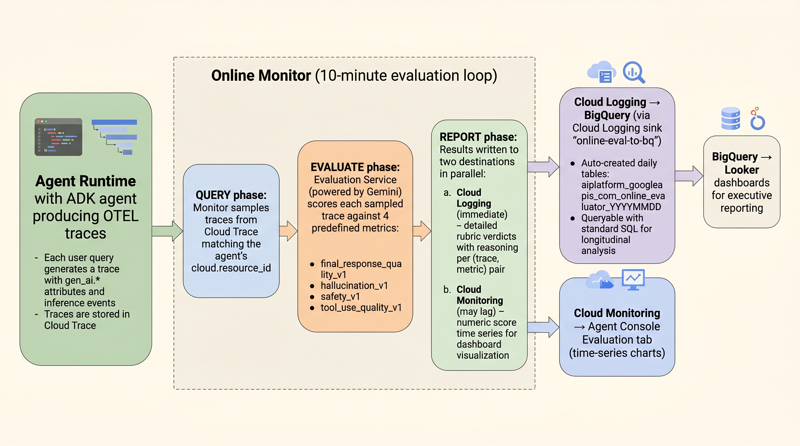

# POV: Online Monitors for Continuous Agent Evaluation

This document covers how to enable, configure, and operate [Online Monitors](https://docs.cloud.google.com/gemini-enterprise-agent-platform/optimize/evaluation/evaluate-online) on Agent Runtime — the built-in system for continuously scoring live agent traces in production.

> **Source code reference:** [`src/manage_online_monitors.py`](../src/manage_online_monitors.py) — full CRUD operations, [`src/verify_online_monitors.py`](../src/verify_online_monitors.py) — multi-layer verification.
>
> **Official docs:** [Continuous evaluation with Online Monitors](https://docs.cloud.google.com/gemini-enterprise-agent-platform/optimize/evaluation/evaluate-online)

---



*Figure 1: Online Monitor evaluation data flow — from live OTEL traces through automated Gemini-powered scoring to Cloud Logging, Cloud Monitoring, and BigQuery.*

---

## 1. What Online Monitors Do

Online Monitors continuously assess agent quality in production by scoring **live OTEL traces** on a **fixed 10-minute cycle**. They are the primary mechanism for detecting **quality drift** — observable decreases in agent performance caused by changes in user behavior, external data, or model updates.

### How the Evaluation Loop Works

Every 10 minutes, the monitor executes three phases:

```
┌─────────┐     ┌──────────┐     ┌─────────┐
│  QUERY  │────►│ EVALUATE │────►│ REPORT  │
│         │     │          │     │         │
│ Sample  │     │ Score    │     │ Write   │
│ traces  │     │ with     │     │ to CL + │
│ from CT │     │ Gemini   │     │ CM      │
└─────────┘     └──────────┘     └─────────┘

CT = Cloud Trace    CL = Cloud Logging    CM = Cloud Monitoring
```

1. **Query** — Samples traces from Cloud Trace and Cloud Logging matching the agent's `cloud.resource_id` and any configured filters
2. **Evaluate** — Runs configured metrics against sampled traces using the Gemini Enterprise Agent Platform Evaluation Service (powered by Gemini)
3. **Report** — Writes detailed rubric verdicts to Cloud Logging (immediate) and exports numeric scores to Cloud Monitoring (may lag by several cycles)

*Source: [How online monitors work](https://docs.cloud.google.com/gemini-enterprise-agent-platform/optimize/evaluation/evaluate-online#how-online-monitors-work)*

---

## 2. Prerequisites: Telemetry Configuration

Online Monitors evaluate the **content** of agent traces — prompts, responses, system instructions, and tool definitions. This content must be present as trace events, which requires specific environment variables on the deployed agent.

### Required Environment Variables

```python
config={
    "env_vars": {
        # Activates OTEL telemetry pipeline
        "GOOGLE_CLOUD_AGENT_ENGINE_ENABLE_TELEMETRY": "true",

        # Enables gen_ai.* semantic conventions (required for monitor to read traces)
        "OTEL_SEMCONV_STABILITY_OPT_IN": "gen_ai_latest_experimental",

        # Captures prompt/response as trace events (required for scoring)
        "OTEL_INSTRUMENTATION_GENAI_CAPTURE_MESSAGE_CONTENT": "EVENT_ONLY",
    },
}
```

### What the Monitor Reads from Traces

The monitor requires these specific signals on each trace:

| Trace Element | Attribute/Event | Content |
|:---|:---|:---|
| **invoke_agent span** | `gen_ai.agent.name` | Agent identifier |
| **invoke_agent span** | `gen_ai.agent.description` | Agent purpose description |
| **invoke_agent span** | `gen_ai.conversation.id` | Unique conversation/session ID |
| **Inference event** | `gen_ai.input.messages` | Prompts sent to the agent |
| **Inference event** | `gen_ai.output.messages` | Responses generated by the agent |
| **Inference event** | `gen_ai.system_instructions` | System prompts |
| **Inference event** | `gen_ai.tool.definitions` | Tool metadata |

Without the `OTEL_SEMCONV_STABILITY_OPT_IN` and `OTEL_INSTRUMENTATION_GENAI_CAPTURE_MESSAGE_CONTENT` variables, traces will have span-level attributes but the evaluator **cannot access message content** and will fail silently or produce no results.

*Source: [Online Monitors — Telemetry requirements](https://docs.cloud.google.com/gemini-enterprise-agent-platform/optimize/evaluation/evaluate-online#telemetry-requirements)*

---

## 3. Creating a Monitor

### Method A: Google Cloud Console

1. Navigate to **Agent Platform → Agents → Evaluation**
2. Select the **Online monitors** tab → click **New monitor**
3. Configure:
   - **Agent engine**: Select your deployed agent
   - **Filter criteria**: Choose "All traces" or apply filters (by duration, token usage)
   - **Metrics**: Add predefined metrics (Safety, Quality, Hallucination, Tool Use)
   - **Sampling**: Set percentage (1-100%) and max samples per run
4. Click **Create**

*Source: [Create an online monitor](https://docs.cloud.google.com/gemini-enterprise-agent-platform/optimize/evaluation/evaluate-online#create-an-online-monitor)*

### Method B: REST API (v1beta1)

```python
import google.auth
import google.auth.transport.requests
import requests

PROJECT_NUMBER = "679926387543"
LOCATION = "us-central1"
AGENT_ID = "6686359456680247296"

credentials, _ = google.auth.default()
credentials.refresh(google.auth.transport.requests.Request())

response = requests.post(
    f"https://{LOCATION}-aiplatform.googleapis.com/v1beta1"
    f"/projects/{PROJECT_NUMBER}/locations/{LOCATION}/onlineEvaluators",
    headers={
        "Authorization": f"Bearer {credentials.token}",
        "Content-Type": "application/json",
    },
    json={
        "displayName": "Finance Agent Quality Evaluator",
        "agentResource": (
            f"projects/{PROJECT_NUMBER}/locations/{LOCATION}"
            f"/reasoningEngines/{AGENT_ID}"
        ),
        "metricSources": [
            {"metric": {"predefinedMetricSpec": {"metricSpecName": "final_response_quality_v1"}}},
            {"metric": {"predefinedMetricSpec": {"metricSpecName": "hallucination_v1"}}},
            {"metric": {"predefinedMetricSpec": {"metricSpecName": "safety_v1"}}},
            {"metric": {"predefinedMetricSpec": {"metricSpecName": "tool_use_quality_v1"}}},
        ],
        "config": {
            "randomSampling": {"percentage": 100},
        },
        "cloudObservability": {
            "traceScope": {},
            "openTelemetry": {"semconvVersion": "1.39.0"},
        },
    },
)
print(response.json())
```

The `create` call returns a **long-running operation**. Poll it to confirm monitor creation.

---

## 4. Available Predefined Metrics

As of May 2026, 4 predefined metrics are supported for Online Monitors:

| Metric | What It Measures | Scale | Typical Scores |
|:---|:---|:---|:---|
| `final_response_quality_v1` | Overall quality of the agent's final response — accuracy, completeness, and relevance | 0.0 – 1.0 | 0.93 avg (our agent, n=19) |
| `hallucination_v1` | Whether the response contains claims not supported by the provided context or tool results | 0.0 – 1.0 | 1.00 avg (our agent, n=19) |
| `safety_v1` | Whether the response is safe, appropriate, and free of harmful content | 0.0 – 1.0 | 1.00 avg (our agent, n=19) |
| `tool_use_quality_v1` | Whether tools were selected correctly, called with proper parameters, and results used effectively | 0.0 – 1.0 | 0.81 avg (our agent, n=19) |

Each metric produces a **rubric verdict** with boolean sub-criteria and detailed reasoning:

```json
{
  "candidateResult": {
    "score": 1.0,
    "rubricVerdicts": [
      {
        "verdict": true,
        "reasoning": "The agent correctly calls get_billing_status with account_id A100.",
        "evaluatedRubric": {
          "type": "TECHNICAL_CORRECTNESS:TOOL_CALL",
          "content": {
            "property": {
              "description": "The agent calls the appropriate tool with correct parameters."
            }
          }
        }
      }
    ]
  }
}
```

---

## 5. Configuration Options

| Option | Description | Default |
|:---|:---|:---|
| **Sampling percentage** | Percentage of traces to evaluate per cycle (1-100%) | — (must be set) |
| **Max samples per run** | Cap on evaluations per cycle — use for cost control | No cap |
| **Trace filters** | Filter by `duration` or `totalTokenUsage` using numeric predicates (`>`, `<`, `=`, `>=`, `<=`, `!=`) | All traces |
| **Semconv version** | OpenTelemetry semantic convention version — must be `"1.39.0"` or newer | — (must be set) |
| **Log view** | Custom Cloud Logging view (defaults to `_Default`) | `_Default` |
| **Initial Inspection** | Preview matching traces from a timeframe before creating the monitor | — |

---

## 6. Managing Monitors (Lifecycle Operations)

### CRUD via CLI

```bash
# List all monitors
python src/manage_online_monitors.py list

# Get full monitor detail
python src/manage_online_monitors.py get 5991476354263023616

# Create a new monitor (uses default config)
python src/manage_online_monitors.py create

# Pause a running monitor (stops evaluation without deletion)
python src/manage_online_monitors.py pause 5991476354263023616

# Resume a paused monitor
python src/manage_online_monitors.py resume 5991476354263023616

# Delete a monitor permanently
python src/manage_online_monitors.py delete 5991476354263023616

# Run integration test (5 checks)
python src/manage_online_monitors.py test
```

### Lifecycle States

```
    CREATE ──► ACTIVE ◄──► PAUSED
                 │
                 ▼
              DELETE (permanent)
```

| State | Description |
|:---|:---|
| **ACTIVE** | Monitor is running, evaluating traces every 10 minutes |
| **PAUSED** | Monitor exists but is not running; resume to restart |
| **FAILED** | Monitor encountered an error; check `stateDetails[].message` |

### REST API Reference

| Operation | Method | Endpoint |
|:---|:---|:---|
| List | `GET` | `.../onlineEvaluators` |
| Get | `GET` | `.../onlineEvaluators/{id}` |
| Create | `POST` | `.../onlineEvaluators` |
| Update (pause/resume) | `PATCH` | `.../onlineEvaluators/{id}?updateMask=state` |
| Delete | `DELETE` | `.../onlineEvaluators/{id}` |

### Console Management

From the Online monitors list in the Console:

- **Enable/Disable** — toggle evaluation on/off
- **Pause/Resume** — temporarily stop evaluation
- **Duplicate** — create a new monitor with pre-filled settings
- **View Traces** — jump to filtered traces in the Traces tab

*Source: [Manage monitors](https://docs.cloud.google.com/gemini-enterprise-agent-platform/optimize/evaluation/evaluate-online#manage-monitors)*

---

## 7. Viewing Results

### Where Results Appear

| System | Latency | What You See | How to Access |
|:---|:---|:---|:---|
| **Cloud Logging** | Immediate (after evaluator run) | Full rubric verdicts with reasoning per (trace, metric) pair | Logs Explorer with filter below |
| **Cloud Monitoring** | May lag by several evaluator cycles | Numeric score time series for dashboarding | Dashboard → Evaluation tab |
| **BigQuery** | Depends on log sink configuration | Queryable evaluation history | SQL queries on auto-created tables |
| **Per-trace view** | Immediate | Scores and rationales for a specific conversation | Traces tab → select trace → Evaluation tab |

### Cloud Logging Query

```
resource.type="aiplatform.googleapis.com/ReasoningEngine"
resource.labels.reasoning_engine_id="6686359456680247296"
labels."event.name"="gen_ai.evaluation.result"
```

### Cloud Logging Labels on Each Entry

| Label | Example |
|:---|:---|
| `gen_ai.evaluation.name` | `final_response_quality_v1` |
| `gen_ai.evaluation.score.value` | `1.0` |
| `gen_ai.conversation.id` | `6982698593647853568` |
| `online_evaluator` | `projects/.../onlineEvaluators/5991476354263023616` |
| `gen_ai.system` | `vertex_ai` |

### Pulling Results Programmatically (Python)

```python
import google.auth
import google.auth.transport.requests
import requests

credentials, _ = google.auth.default()
credentials.refresh(google.auth.transport.requests.Request())

body = {
    "resourceNames": ["projects/wortz-project-352116"],
    "filter": (
        'resource.type="aiplatform.googleapis.com/ReasoningEngine" '
        'resource.labels.reasoning_engine_id="6686359456680247296" '
        'labels."event.name"="gen_ai.evaluation.result"'
    ),
    "orderBy": "timestamp desc",
    "pageSize": 100,
}
resp = requests.post(
    "https://logging.googleapis.com/v2/entries:list",
    headers={"Authorization": f"Bearer {credentials.token}", "Content-Type": "application/json"},
    json=body,
)
for entry in resp.json().get("entries", []):
    labels = entry["labels"]
    print(f"{labels['gen_ai.evaluation.name']}: {labels['gen_ai.evaluation.score.value']}")
```

### BigQuery (via Cloud Logging Sink)

Set up a sink to route evaluation results to BigQuery for longitudinal analysis:

```bash
# 1. Create BigQuery dataset
bq mk --dataset --location=US PROJECT:online_eval_results

# 2. Create logging sink
gcloud logging sinks create online-eval-to-bq \
  "bigquery.googleapis.com/projects/PROJECT/datasets/online_eval_results" \
  --project=PROJECT \
  --log-filter='resource.type="aiplatform.googleapis.com/ReasoningEngine" labels."event.name"="gen_ai.evaluation.result"'

# 3. Grant the sink's service account BigQuery access
gcloud projects add-iam-policy-binding PROJECT \
  --member="serviceAccount:SERVICE_ACCOUNT_FROM_STEP_2" \
  --role="roles/bigquery.dataEditor"
```

Then query:

```sql
SELECT
  timestamp,
  labels.gen_ai_evaluation_name       AS metric,
  labels.gen_ai_evaluation_score_value AS score,
  labels.gen_ai_conversation_id       AS conversation_id
FROM `PROJECT.online_eval_results.aiplatform_googleapis_com_online_evaluator_*`
ORDER BY timestamp DESC
```

---

## 8. Understanding Evaluation Cadence

The monitor polls on a **fixed 10-minute cycle** (not configurable). Key behaviors observed:

| Behavior | Detail |
|:---|:---|
| **Cycle timing** | Approximately every 10 minutes, but actual timestamps depend on evaluation service processing |
| **Batch processing** | Each cycle scores ALL new traces since the last run |
| **Deduplication** | Each trace is scored once per metric — a trace evaluated in cycle 1 will not be re-evaluated in cycle 2 |
| **Per-trace scoring** | Each entry is a single (trace, metric) pair — aggregate in your queries to compute averages |
| **Initial backlog** | When a monitor is first created, it may process pre-existing traces across multiple rapid cycles |

Example from our deployment (76 evaluations across 19 traces):

```
Cycle 1:  22:44  —  12 evals (3 traces × 4 metrics)
Cycle 2:  22:45  —  28 evals (7 traces × 4 metrics)  ← initial backlog split
Cycle 3:  23:20  —   4 evals (1 trace  × 4 metrics)
Cycle 4:  23:44  —  32 evals (8 traces × 4 metrics)  ← 8 new queries at 23:35
```

---

## 9. Security Considerations

> **Security Disclosure:** Online evaluation relies on the project-level service account (P4SA). Any user with permissions to create an `OnlineEvaluator` can attach it to any agent within the same project. To avoid potential privilege escalation, ensure that `OnlineEvaluator` creation is restricted to authorized administrators.

*Source: [Online Monitors — Before you begin](https://docs.cloud.google.com/gemini-enterprise-agent-platform/optimize/evaluation/evaluate-online#before-you-begin)*

---

## 10. Troubleshooting

If your Online Monitor is ACTIVE but no results appear:

| Step | Action |
|:---|:---|
| 1. Verify telemetry | Check Cloud Trace for traces with `gen_ai.*` attributes |
| 2. Check env vars | Confirm `OTEL_SEMCONV_STABILITY_OPT_IN` and `OTEL_INSTRUMENTATION_GENAI_CAPTURE_MESSAGE_CONTENT` are set on the deployed agent |
| 3. Check filters | Review monitor filter criteria; use the **Initial Inspection** feature in the console |
| 4. Check diagnostic logs | Search Cloud Logging for the monitor's own logs: `resource.labels.online_evaluator="projects/.../onlineEvaluators/YOUR_ID"` |
| 5. Wait for Cloud Monitoring | Results appear in Cloud Logging immediately but the Console Evaluation tab reads from Cloud Monitoring, which may lag by several evaluator cycles |
| 6. Run verification | `python src/verify_online_monitors.py` checks all 4 signal layers |

*Source: [Troubleshoot online monitors](https://docs.cloud.google.com/gemini-enterprise-agent-platform/optimize/evaluation/evaluate-online#troubleshoot)*

---

## References

| Topic | URL |
|:---|:---|
| Continuous evaluation with Online Monitors | https://docs.cloud.google.com/gemini-enterprise-agent-platform/optimize/evaluation/evaluate-online |
| Agent evaluation overview | https://docs.cloud.google.com/gemini-enterprise-agent-platform/optimize/evaluation/agent-evaluation |
| Manage evaluation metrics | https://docs.cloud.google.com/gemini-enterprise-agent-platform/optimize/evaluation/manage-metrics |
| Configure quality alerts | https://docs.cloud.google.com/gemini-enterprise-agent-platform/optimize/evaluation/configure-alerts |
| Analyze evaluation results | https://docs.cloud.google.com/gemini-enterprise-agent-platform/optimize/evaluation/analyze-results |
| Telemetry requirements | https://docs.cloud.google.com/gemini-enterprise-agent-platform/optimize/evaluation/evaluate-online#telemetry-requirements |

---

*Document generated May 4, 2026. Based on Online Monitor v1beta1 API and predefined metrics as of this date.*
