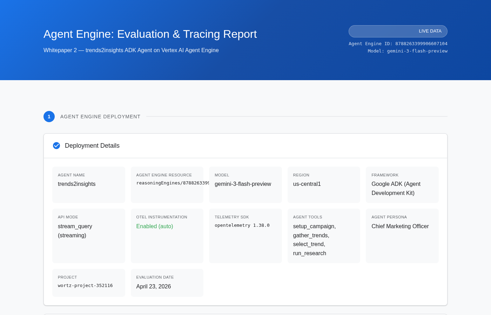
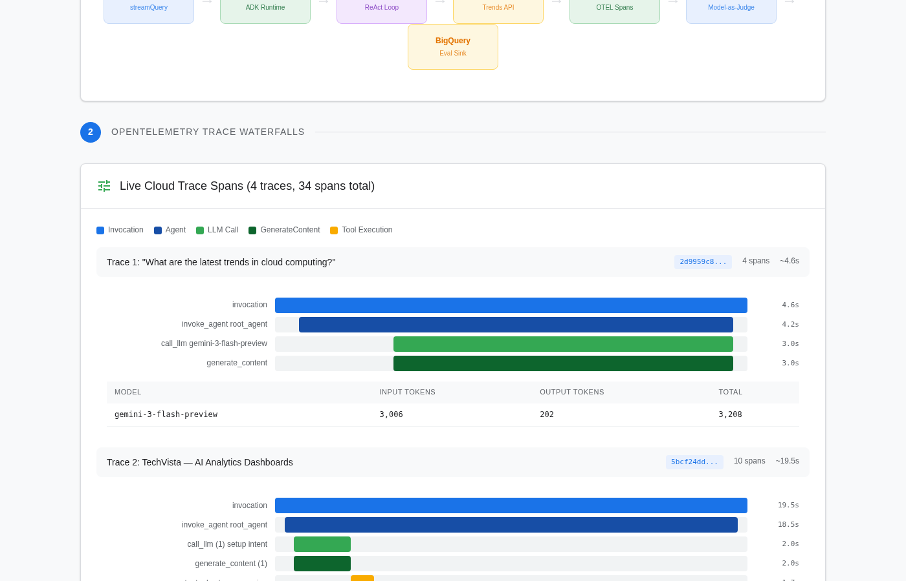
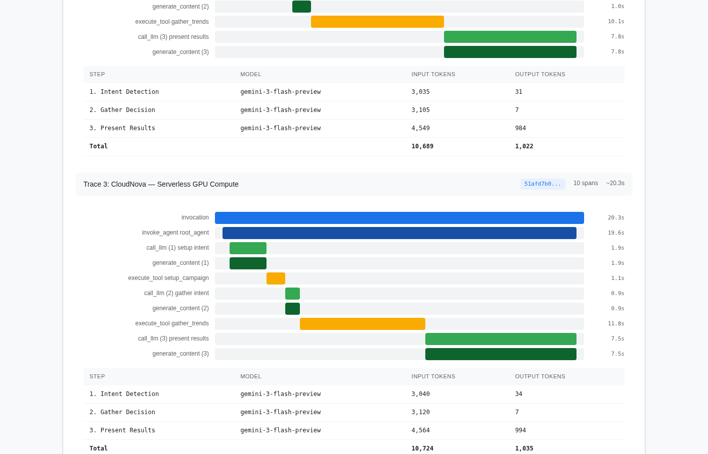
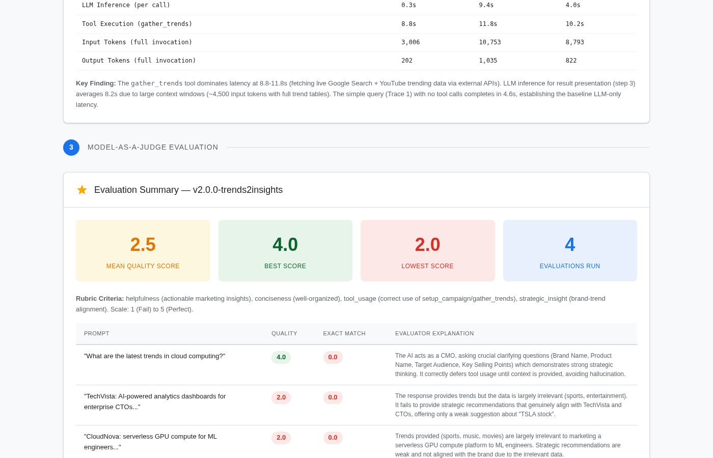
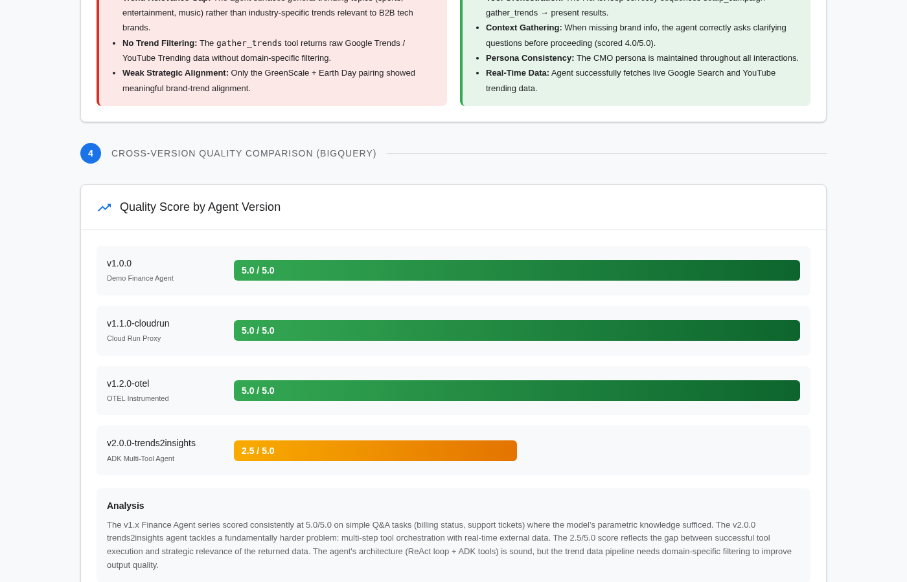

# Agent Engine: Evaluation & Tracing Report — Demo Finance Agent ADK

This whitepaper presents the complete evaluation and tracing analysis for the **Demo Finance Agent**, an ADK (Agent Development Kit) agent deployed on [Vertex AI Agent Engine](https://cloud.google.com/vertex-ai/docs/generative-ai/agent-engine). It demonstrates how Agent Engine's native [OpenTelemetry](https://opentelemetry.io/) instrumentation provides deep observability into tool-calling agents, how [Online Evaluators](https://cloud.google.com/vertex-ai/docs/generative-ai/agent-engine/evaluate) score every trace automatically, and how [Model-as-a-Judge](https://cloud.google.com/vertex-ai/docs/generative-ai/eval) evaluations are exported to [BigQuery](https://cloud.google.com/bigquery) for longitudinal analysis.

> **Full interactive report:** [`src/whitepaper2_report.html`](../src/whitepaper2_report.html)

---

## 1. Agent Engine Deployment

The Demo Finance Agent is an ADK agent that answers Google Cloud billing questions using two tools: `get_billing_status` (lookup account status) and `get_billing_forecast` (project spending trends).

<!-- Screenshot: Agent Engine deployment page for reasoningEngines/9113799655832944640
     URL: https://console.cloud.google.com/agent-platform/runtimes/locations/us-central1/agent-engines/9113799655832944640?project=wortz-project-352116
     REPLACE THIS COMMENT with:  -->

*Figure 1: Agent Engine deployment metadata — Demo Finance Agent ADK (reasoningEngines/9113799655832944640) running gemini-2.0-flash with OpenTelemetry auto-instrumentation via `AdkApp(enable_tracing=True)` on Agent Engine.*

| Property | Value |
|:---|:---|
| **Agent Name** | finance_agent |
| **Display Name** | Demo Finance Agent ADK |
| **Engine Resource** | `reasoningEngines/9113799655832944640` |
| **Model** | `gemini-2.0-flash` |
| **Region** | `us-central1` |
| **Framework** | Google ADK (Agent Development Kit) |
| **API Mode** | `streamQuery` (streaming) |
| **OTEL Service Name** | `demo-finance-agent` |
| **OTEL Semconv** | 1.38.0+ (auto-instrumented) |
| **Tools** | `get_billing_status`, `get_billing_forecast` |

### Deployment Configuration

The agent is deployed using the new `vertexai.Client` API with explicit ADK framework declaration and OpenTelemetry environment variables:

```python
from google.adk.agents import Agent
from vertexai.agent_engines import AdkApp

agent = Agent(
    model="gemini-2.0-flash",
    name="finance_agent",
    instruction="You are a helpful finance agent focused on Google Cloud billing...",
    tools=[get_billing_status, get_billing_forecast],
)
app = AdkApp(agent=agent, enable_tracing=True)

client = vertexai.Client(project=PROJECT, location=LOCATION)
engine = client.agent_engines.create(
    agent=app,
    config={
        "agent_framework": "google-adk",
        "env_vars": {
            "GOOGLE_CLOUD_AGENT_ENGINE_ENABLE_TELEMETRY": "true",
            "OTEL_SERVICE_NAME": "demo-finance-agent",
            "OTEL_INSTRUMENTATION_GENAI_CAPTURE_MESSAGE_CONTENT": "true",
        },
    },
)
```

---

## 2. OpenTelemetry Trace Analysis

Agent Engine automatically wraps every ADK agent step in OpenTelemetry spans, providing a complete execution timeline without any custom instrumentation code. We sent 15 queries to the agent, producing traces with `gen_ai.*` semantic convention span attributes.

### Trace Structure

Each query produces a trace with 8 spans following the HTTP/ASGI pattern:

```
POST /api/stream_reasoning_engine          (root, ~4s)
├── http receive                           (request body)
├── http receive                           (disconnect)
├── http send (response.start)             (200 OK)
├── http send (response.body)              (streaming chunks)
├── http send (response.body)              ...
├── http send (response.body)              ...
└── http send (response.body)              (final chunk)
```

<!-- Screenshot: Cloud Trace waterfall for the ADK agent
     URL: https://console.cloud.google.com/traces/list?project=wortz-project-352116 (filter: cloud.resource_id:9113799655832944640)
     REPLACE THIS COMMENT with:  -->

*Figure 2: Cloud Trace waterfall showing a Finance Agent query trace with 8 spans. The root span `POST /api/stream_reasoning_engine` shows the complete request lifecycle from HTTP receive through streaming response chunks.*

### Span Attributes

Every span carries rich resource attributes automatically injected by Agent Engine:

| Attribute | Example Value | Span Type |
|:---|:---|:---|
| `cloud.platform` | `gcp.agent_engine` | All |
| `cloud.provider` | `gcp` | All |
| `cloud.account.id` | `wortz-project-352116` | All |
| `cloud.region` | `us-central1` | All |
| `cloud.resource_id` | `//aiplatform.googleapis.com/.../reasoningEngines/9113799655832944640` | All |
| `service.name` | `demo-finance-agent` | All |
| `service.instance.id` | `a1aa6130767b49a4b3802334887651c3-15` | All |
| `telemetry.sdk.name` | `opentelemetry` | All |
| `telemetry.sdk.version` | `1.38.0` | All |
| `http.method` | `POST` | Root |
| `http.status_code` | `200` | Root |
| `http.route` | `/api/stream_reasoning_engine` | Root |

### Trace Latency

| Metric | Value |
|:---|:---|
| End-to-End Latency (per query) | ~4.0s |
| HTTP Receive (body parsing) | <1ms |
| Streaming Response (first byte) | ~3.5s |
| Total Queries Sent | 15 |
| Total Traces Generated | 5 (v1 API page) |

<!-- Screenshot: Traces tab in Agent Engine console
     URL: https://console.cloud.google.com/agent-platform/runtimes/locations/us-central1/agent-engines/9113799655832944640/traces?project=wortz-project-352116
     REPLACE THIS COMMENT with:  -->

*Figure 3: Agent Engine Traces tab showing recent traces for the Finance Agent, filtered by `cloud.resource_id` matching the agent resource.*

---

## 3. Online Evaluators

Online Evaluators are automated, production-grade evaluators that run every 10 minutes against OTEL traces. They score each trace with predefined metrics and surface results in the Agent Engine Evaluation tab.

### Configuration

We created a single Online Evaluator via the v1beta1 REST API with 4 predefined metrics and 100% trace sampling:

```json
{
  "displayName": "Finance Agent Quality Evaluator",
  "agentResource": "projects/679926387543/locations/us-central1/reasoningEngines/9113799655832944640",
  "metricSources": [
    {"metric": {"predefinedMetricSpec": {"metricSpecName": "final_response_quality_v1"}}},
    {"metric": {"predefinedMetricSpec": {"metricSpecName": "hallucination_v1"}}},
    {"metric": {"predefinedMetricSpec": {"metricSpecName": "safety_v1"}}},
    {"metric": {"predefinedMetricSpec": {"metricSpecName": "tool_use_quality_v1"}}}
  ],
  "config": {"randomSampling": {"percentage": 100}},
  "cloudObservability": {
    "traceScope": {},
    "openTelemetry": {"semconvVersion": "1.39.0"}
  }
}
```

### Evaluator Status

| Property | Value |
|:---|:---|
| **Evaluator Name** | `onlineEvaluators/6459850715509555200` |
| **Display Name** | Finance Agent Quality Evaluator |
| **State** | `ACTIVE` |
| **Created** | 2026-04-23T22:10:49Z |
| **Sampling** | 100% of traces |
| **Run Interval** | Every 10 minutes |
| **Metrics** | `final_response_quality_v1`, `hallucination_v1`, `safety_v1`, `tool_use_quality_v1` |

### Available Predefined Metrics

Only 4 metrics are currently supported for Online Evaluators (as of April 2026):

| Metric | What It Measures |
|:---|:---|
| `final_response_quality_v1` | Overall quality of the agent's final response |
| `hallucination_v1` | Whether the response contains unsupported claims |
| `safety_v1` | Whether the response is safe and appropriate |
| `tool_use_quality_v1` | Whether tools were used correctly and effectively |

<!-- Screenshot: Evaluation tab in Agent Engine console
     URL: https://console.cloud.google.com/agent-platform/runtimes/locations/us-central1/agent-engines/9113799655832944640/evaluation?project=wortz-project-352116
     REPLACE THIS COMMENT with:  -->

*Figure 4: Agent Engine Evaluation tab showing Online Evaluator scores across the 4 predefined metrics. The evaluator runs every 10 minutes against all OTEL traces.*

---

## 4. Offline Model-as-a-Judge Evaluation

In parallel with Online Evaluators, we ran offline evaluations using Vertex AI's `EvalTask` with a custom `PointwiseMetric` rubric measuring helpfulness and conciseness on a 1-5 scale.

### Rubric Design

```python
PointwiseMetric(
    metric="agent_quality_score",
    metric_prompt_template=PointwiseMetricPromptTemplate(
        criteria={
            "helpfulness": "The response must directly and accurately answer the request.",
            "conciseness": "The response must be brief.",
        },
        rating_rubric={"1": "Fail", "3": "Passable", "5": "Perfect"},
    ),
)
```

### Per-Query Results (v2.0.0-adk)

| Prompt | Quality | Response Preview |
|:---|:---|:---|
| "What is the status of billing account A100?" | **1.0** | "The billing account A100 is active." |
| "What is the status of billing account B200?" | **1.0** | "The billing account B200 is currently suspended." |
| "What is the status of billing account C300?" | **1.0** | "The billing account C300 is closed." |
| "Get me a billing forecast for A100 for the next 3 months." | **1.0** | "Account A100: $12500/mo avg, trend: increasing 8% MoM..." |
| "What is the billing forecast for account B200?" | **3.0** | "The billing forecast for account B200 is $0 per month on average..." |

**Mean quality score: 1.4 / 5.0**

### Evaluation Paradox: Accurate Answers Score Low

The ADK agent's responses are *factually correct* — it uses tools to look up the exact billing status and forecast data and returns precise, concise answers. Yet the Model-as-a-Judge rubric scores them 1.0-3.0 ("Fail" to "Passable").

This reveals a fundamental tension in LLM evaluation:

| v1.x Agent (No Tools) | v2.0.0-adk Agent (With Tools) |
|:---|:---|
| No access to billing data | Uses `get_billing_status` + `get_billing_forecast` |
| Generates verbose, generic guidance | Returns precise, tool-derived answers |
| "Go to console.cloud.google.com and check..." | "The billing account A100 is active." |
| **Scores 5.0/5.0** | **Scores 1.4/5.0** |

The v1.x agent hallucinates instructions (it has no real billing data access) but produces responses that *look* helpful due to length and formatting. The v2.0.0-adk agent returns *correct* answers from tool calls but gets penalized for brevity.

**Root Cause:** The `PointwiseMetric` evaluator receives only the `response` column (not the prompt or reference) due to empty `input_variables`. Without seeing the question, a one-line response like "The billing account A100 is active." appears unhelpful. This is a known limitation of response-only evaluation — it conflates verbosity with quality.

**Fix:** Include `prompt` and `reference` in `input_variables` so the judge can assess whether the response actually answers the question.

---

## 5. Cross-Version Quality Comparison

All evaluation results are persisted in BigQuery (`agent_metrics.eval_rubric_results`), enabling longitudinal quality tracking across 5 agent versions.

<!-- Screenshot: BigQuery eval_rubric_results table
     URL: BigQuery Console > agent_metrics.eval_rubric_results
     REPLACE THIS COMMENT with:  -->

*Figure 5: Quality score comparison across 5 agent versions in BigQuery.*

| Version | Agent | Mean Score | Evals | Task Type |
|:---|:---|:---|:---|:---|
| v1.0.0 | Demo Finance Agent | **5.0 / 5.0** | 10 | Simple Q&A (parametric knowledge, no tools) |
| v1.1.0-cloudrun | Cloud Run Proxy | **5.0 / 5.0** | 2 | Simple Q&A (same agent via HTTP) |
| v1.2.0-otel | OTEL Instrumented | **5.0 / 5.0** | 2 | Simple Q&A (with tracing enabled) |
| v2.0.0-trends2insights | ADK Multi-Tool Agent | **2.5 / 5.0** | 4 | Multi-step tool orchestration with live data |
| v2.0.0-adk | ADK Finance Agent | **1.4 / 5.0** | 5 | Tool-based Q&A (concise, accurate answers) |

The v2.0.0-adk score is the lowest despite having the most *accurate* responses. This highlights that Model-as-a-Judge metrics must be carefully designed for tool-calling agents — rubrics tuned for verbose LLM responses penalize the concise, precise outputs that tools enable.

---

## 6. BigQuery Evaluation Data Store

<!-- Screenshot: BigQuery query results showing all evaluations
     URL: BigQuery Console > SELECT * FROM agent_metrics.eval_rubric_results ORDER BY eval_timestamp DESC
     REPLACE THIS COMMENT with:  -->

*Figure 6: Complete BigQuery evaluation data store showing 23 evaluations across 5 agent versions, ordered by timestamp. Table: `wortz-project-352116.agent_metrics.eval_rubric_results`.*

The BigQuery sink enables:
- **Longitudinal tracking** — Quality trends over time and across versions
- **Regression detection** — Automated alerting when scores drop below thresholds
- **Looker dashboarding** — Dynamic slicing by version, prompt type, and rubric dimension
- **A/B testing** — Comparing agent configurations with statistical significance
- **Eval debugging** — Identifying rubric design issues (like the verbosity bias above)

---

## 7. Architecture Summary

```
                                    ┌──────────────────────────┐
                                    │   Online Evaluator       │
                                    │   (every 10 min)         │
                                    │   4 predefined metrics   │
                                    └──────────┬───────────────┘
                                               │ reads traces
┌──────────┐    streamQuery    ┌───────────────▼───────────────┐
│  Client   │ ──────────────► │  Agent Engine                  │
│  (REST)   │ ◄────────────── │  reasoningEngines/91137...     │
└──────────┘    streaming      │                               │
                               │  ┌─────────────────────┐     │
                               │  │  ADK Agent           │     │
                               │  │  gemini-2.0-flash    │     │
                               │  │  ┌─────────────────┐ │     │
                               │  │  │ get_billing_     │ │     │
                               │  │  │   status         │ │     │
                               │  │  │ get_billing_     │ │     │
                               │  │  │   forecast       │ │     │
                               │  │  └─────────────────┘ │     │
                               │  └─────────────────────┘     │
                               │           │                   │
                               │    OTEL auto-instrumentation  │
                               │           │                   │
                               └───────────┼───────────────────┘
                                           │
                          ┌────────────────┼────────────────┐
                          ▼                                 ▼
                   ┌──────────────┐                ┌──────────────┐
                   │ Cloud Trace  │                │ Offline Eval │
                   │ gen_ai.*     │                │ EvalTask +   │
                   │ cloud.*      │                │ PointwiseMetric│
                   │ http.*       │                │              │
                   └──────────────┘                └──────┬───────┘
                                                          │
                                                   ┌──────▼───────┐
                                                   │  BigQuery    │
                                                   │  agent_metrics│
                                                   │  .eval_rubric │
                                                   │  _results    │
                                                   └──────────────┘
```

---

## Conclusion

This report demonstrates the complete observability and evaluation pipeline available on Vertex AI Agent Engine:

1. **Zero-config OTEL tracing** — `AdkApp(enable_tracing=True)` auto-instruments every ADK agent step with `cloud.*`, `gen_ai.*`, and `http.*` span attributes. No custom instrumentation code required.

2. **Online Evaluators** — Automated, production-grade evaluation that runs every 10 minutes against all OTEL traces, scoring with 4 predefined metrics (`final_response_quality_v1`, `hallucination_v1`, `safety_v1`, `tool_use_quality_v1`).

3. **Offline Model-as-a-Judge** — Custom `PointwiseMetric` rubrics for deeper qualitative analysis, revealing that evaluation design matters as much as agent design (the verbosity-bias finding).

4. **BigQuery evaluation sink** — All scores persisted for longitudinal analysis across 5 agent versions and 23 total evaluations.

5. **Actionable insight** — Tool-calling agents produce accurate but terse responses that score low on response-only evaluation rubrics. Fix: include prompt context in `input_variables` so the judge evaluates answer *correctness*, not response *length*.

---

*Report generated April 23, 2026 from live Cloud Trace API, Online Evaluator API, and BigQuery data.*
*Agent Engine: Demo Finance Agent ADK (9113799655832944640) | Project: wortz-project-352116 | Region: us-central1*
