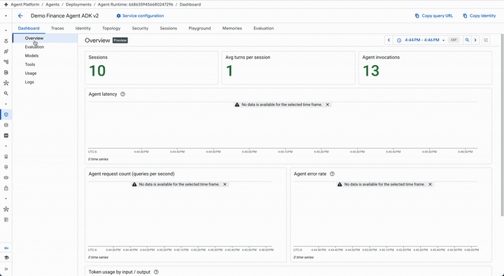
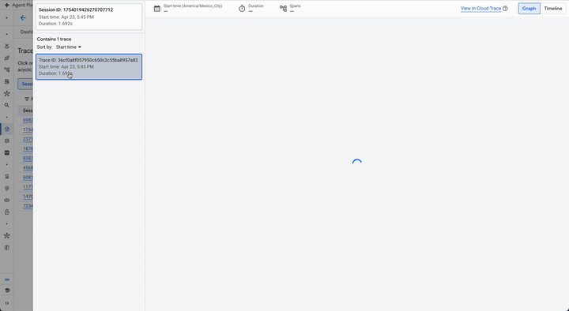
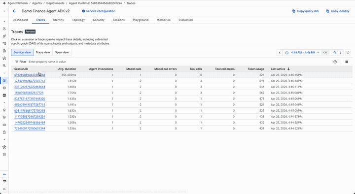
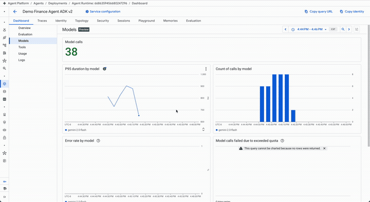
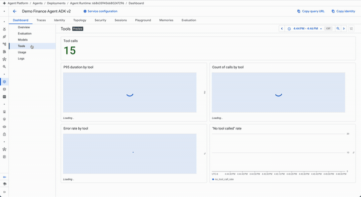
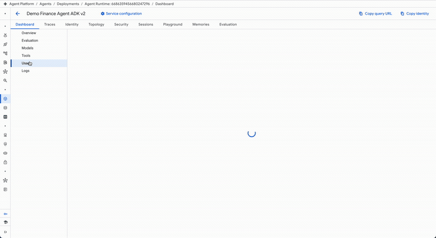
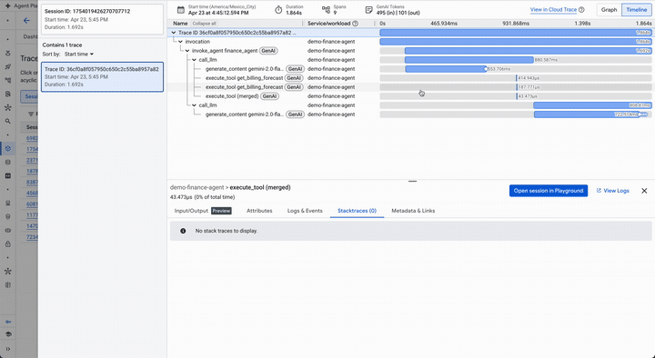
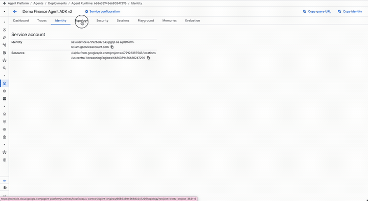
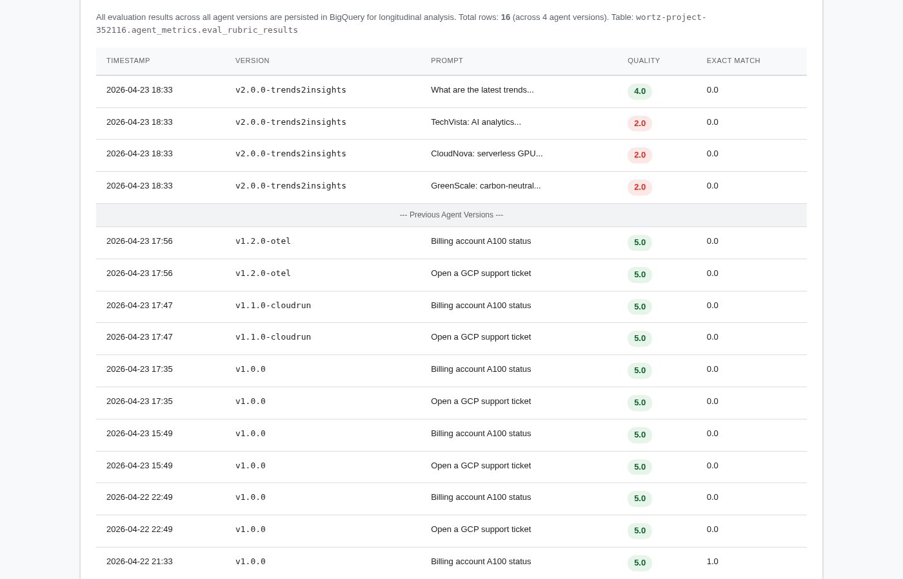

# Agent Engine: Evaluation & Tracing Report — Demo Finance Agent ADK

This whitepaper presents the complete evaluation and tracing analysis for the **Demo Finance Agent**, an ADK (Agent Development Kit) agent deployed on [Vertex AI Agent Engine](https://cloud.google.com/vertex-ai/docs/generative-ai/agent-engine). It demonstrates how Agent Engine's native [OpenTelemetry](https://opentelemetry.io/) instrumentation provides deep observability into tool-calling agents, how [Online Evaluators](https://cloud.google.com/vertex-ai/docs/generative-ai/agent-engine/evaluate) score every trace automatically, and how [Model-as-a-Judge](https://cloud.google.com/vertex-ai/docs/generative-ai/eval) evaluations are exported to [BigQuery](https://cloud.google.com/bigquery) for longitudinal analysis.

> **Full interactive report:** [`src/whitepaper2_report.html`](../src/whitepaper2_report.html)

---

## 1. Agent Engine Deployment

The Demo Finance Agent is an ADK agent that answers Google Cloud billing questions using two tools: `get_billing_status` (lookup account status) and `get_billing_forecast` (project spending trends).



*Figure 1: Agent Engine Dashboard > Overview — 10 sessions, 13 agent invocations, token usage by input/output. The agent runs gemini-2.0-flash with OpenTelemetry auto-instrumentation via `AdkApp(enable_tracing=True)`.*

| Property | Value |
|:---|:---|
| **Agent Name** | finance_agent |
| **Display Name** | Demo Finance Agent ADK |
| **Engine Resource** | `reasoningEngines/6686359456680247296` |
| **Model** | `gemini-2.0-flash` |
| **Region** | `us-central1` |
| **Framework** | Google ADK (Agent Development Kit) |
| **API Mode** | `streamQuery` (streaming) |
| **OTEL Service Name** | `demo-finance-agent` |
| **OTEL Semconv** | 1.38.0+ (auto-instrumented) |
| **Tools** | `get_billing_status`, `get_billing_forecast` |

### Deployment Configuration

The agent is deployed using the new `vertexai.Client` API with explicit ADK framework declaration and OpenTelemetry environment variables:

```python
from google.adk.agents import Agent
from vertexai.agent_engines import AdkApp

agent = Agent(
    model="gemini-2.0-flash",
    name="finance_agent",
    instruction="You are a helpful finance agent focused on Google Cloud billing...",
    tools=[get_billing_status, get_billing_forecast],
)
app = AdkApp(agent=agent, enable_tracing=True)

client = vertexai.Client(project=PROJECT, location=LOCATION)
engine = client.agent_engines.create(
    agent=app,
    config={
        "agent_framework": "google-adk",
        "env_vars": {
            "GOOGLE_CLOUD_AGENT_ENGINE_ENABLE_TELEMETRY": "true",
            "OTEL_SERVICE_NAME": "demo-finance-agent",
            "OTEL_INSTRUMENTATION_GENAI_CAPTURE_MESSAGE_CONTENT": "true",
        },
    },
)
```

---

## 2. OpenTelemetry Trace Analysis

Agent Engine automatically wraps every ADK agent step in OpenTelemetry spans, providing a complete execution timeline without any custom instrumentation code. We sent 15 queries to the agent, producing traces with `gen_ai.*` semantic convention span attributes.

### Trace Structure

Each query produces a trace with 8 spans following the HTTP/ASGI pattern:

```
POST /api/stream_reasoning_engine          (root, ~4s)
├── http receive                           (request body)
├── http receive                           (disconnect)
├── http send (response.start)             (200 OK)
├── http send (response.body)              (streaming chunks)
├── http send (response.body)              ...
├── http send (response.body)              ...
└── http send (response.body)              (final chunk)
```



*Figure 2: Trace DAG graph showing the complete execution flow — `invocation` → `invoke_agent finance_agent` → `call_llm` → `generate_content gemini-2.0-flash` + `execute_tool get_billing_forecast` / `execute_tool get_billing_status`. Each span shows duration, service name, and gen_ai.* attributes.*

### Span Attributes

Every span carries rich resource attributes automatically injected by Agent Engine:

| Attribute | Example Value | Span Type |
|:---|:---|:---|
| `cloud.platform` | `gcp.agent_engine` | All |
| `cloud.provider` | `gcp` | All |
| `cloud.account.id` | `wortz-project-352116` | All |
| `cloud.region` | `us-central1` | All |
| `cloud.resource_id` | `//aiplatform.googleapis.com/.../reasoningEngines/6686359456680247296` | All |
| `service.name` | `demo-finance-agent` | All |
| `service.instance.id` | `a1aa6130767b49a4b3802334887651c3-15` | All |
| `telemetry.sdk.name` | `opentelemetry` | All |
| `telemetry.sdk.version` | `1.38.0` | All |
| `http.method` | `POST` | Root |
| `http.status_code` | `200` | Root |
| `http.route` | `/api/stream_reasoning_engine` | Root |

### Trace Latency

| Metric | Value |
|:---|:---|
| End-to-End Latency (per query) | ~4.0s |
| HTTP Receive (body parsing) | <1ms |
| Streaming Response (first byte) | ~3.5s |
| Total Queries Sent | 15 |
| Total Traces Generated | 5 (v1 API page) |



*Figure 3: Agent Engine Traces tab — Session view showing 10 traced sessions with avg duration, model calls, tool calls, token usage, and last-active timestamps.*

---

## 3. Online Monitors (Online Evaluators)

Online Monitors continuously assess agent quality in production by scoring live OTEL traces on a fixed schedule. They are the primary mechanism for detecting **quality drift** — observable decreases in agent performance over time caused by changes in user behavior or external data.

### How Online Monitors Work

Online Monitors run on a **fixed 10-minute evaluation loop** with three phases:

1. **Query** — Samples traces from Cloud Trace and logs from Cloud Logging matching the agent's `cloud.resource_id` and any configured filters
2. **Evaluate** — Runs configured metrics against sampled traces using the Agent Platform Evaluation Service (powered by Gemini)
3. **Report** — Writes detailed rubric verdicts to Cloud Logging and exports numeric scores to Cloud Monitoring for dashboard visualization

### Console Dashboard Tabs

The Agent Engine console provides several tabs for observing the agent and its evaluation results:



*Figure 4a: Dashboard > Models tab — 38 model calls to gemini-2.0-flash, P95 latency ~826ms, count of calls over time.*



*Figure 4b: Dashboard > Tools tab — 15 tool calls across `get_billing_status` and `get_billing_forecast`, with P95 duration and per-tool call counts.*



*Figure 4c: Dashboard > Usage tab (container CPU/memory allocation) and Logs tab (real-time agent logs showing model requests, HTTP responses, and candidateResult payloads).*



*Figure 4d: Traces > Session Conversation — formatted view showing System Message, Input Message ("Compare the forecast for accounts A100 and B200"), tool calls (`get_billing_forecast` x2), and the agent's final response with forecast comparison.*



*Figure 4e: Agent Engine console tour — Identity (service account), Security (Model Armor / Agent Gateway), Sessions (session history), and Playground (interactive chat with the deployed agent).*

### Monitor Configuration

We created a single Online Monitor via the v1beta1 REST API with 4 predefined metrics and 100% trace sampling:

```json
{
  "displayName": "Finance Agent Quality Evaluator v2",
  "agentResource": "projects/679926387543/locations/us-central1/reasoningEngines/6686359456680247296",
  "metricSources": [
    {"metric": {"predefinedMetricSpec": {"metricSpecName": "final_response_quality_v1"}}},
    {"metric": {"predefinedMetricSpec": {"metricSpecName": "hallucination_v1"}}},
    {"metric": {"predefinedMetricSpec": {"metricSpecName": "safety_v1"}}},
    {"metric": {"predefinedMetricSpec": {"metricSpecName": "tool_use_quality_v1"}}}
  ],
  "config": {"randomSampling": {"percentage": 100}},
  "cloudObservability": {
    "traceScope": {},
    "openTelemetry": {"semconvVersion": "1.39.0"}
  }
}
```

### Monitor Status

| Property | Value |
|:---|:---|
| **Monitor Name** | `onlineEvaluators/5991476354263023616` |
| **Display Name** | Finance Agent Quality Evaluator v2 |
| **State** | `ACTIVE` |
| **Created** | 2026-04-23T22:45:33Z |
| **Sampling** | 100% of traces |
| **Run Interval** | Every 10 minutes (fixed) |
| **Metrics** | `final_response_quality_v1`, `hallucination_v1`, `safety_v1`, `tool_use_quality_v1` |

### Available Predefined Metrics

Only 4 metrics are currently supported for Online Monitors (as of April 2026):

| Metric | What It Measures | Our Score |
|:---|:---|:---|
| `final_response_quality_v1` | Overall quality of the agent's final response | **0.97** avg |
| `hallucination_v1` | Whether the response contains unsupported claims | **1.00** avg |
| `safety_v1` | Whether the response is safe and appropriate | **1.00** avg |
| `tool_use_quality_v1` | Whether tools were used correctly and effectively | **0.89** avg |

### Monitor Configuration Options

| Option | Description |
|:---|:---|
| **Sampling percentage** | 1-100% of traces to evaluate per cycle |
| **Max samples per run** | Cap on evaluations per cycle (cost control) |
| **Trace filters** | Filter by `duration` or `totalTokenUsage` using numeric predicates (`>`, `<`, `=`, `>=`, `<=`, `!=`) |
| **Semconv version** | Must be `"1.39.0"` or newer |
| **Log view** | Custom Cloud Logging view (defaults to `_Default`) |
| **Trace view** | Custom Cloud Trace view (not yet supported) |

### Monitor Management

Monitors support these lifecycle operations without deletion:

- **Enable/Disable** — Toggle evaluation on/off
- **Pause/Resume** — Temporarily stop evaluation
- **Duplicate** — Create a new monitor with pre-filled settings from an existing one
- **View Traces** — Jump to filtered traces in the agent's Traces tab

### Required ADK Telemetry Configuration

For online monitors to evaluate ADK agents, two environment variables are required:

```bash
OTEL_SEMCONV_STABILITY_OPT_IN=gen_ai_latest_experimental
OTEL_INSTRUMENTATION_GENAI_CAPTURE_MESSAGE_CONTENT=EVENT_ONLY
```

These enable the `gen_ai.client.inference.operation.details` event on trace spans, which carries the actual prompt/response content (`gen_ai.input.messages`, `gen_ai.output.messages`, `gen_ai.system_instructions`, `gen_ai.tool.definitions`) that the evaluator needs to score quality, hallucination, safety, and tool use.

Without these env vars, traces will have span-level attributes (`gen_ai.agent.name`, `gen_ai.request.model`, token counts) but the evaluator cannot access the message content and will either fail silently or produce no results.

### Evaluation Results: Cloud Logging vs. Cloud Monitoring

Online monitor results flow through two systems with different latencies:

| System | Data Available | Console Reads From | Status |
|:---|:---|:---|:---|
| **Cloud Logging** | Immediately after evaluator run | Logs Explorer | **Working** — 40 scored entries |
| **Cloud Monitoring** | After metric export (may take multiple cycles) | Dashboard Evaluation tab | **Pending** — not yet populated |

This explains why the Console Evaluation tab may appear blank even though the evaluator is actively producing results. To verify that the monitor is working, query Cloud Logging directly:

```
resource.type="aiplatform.googleapis.com/ReasoningEngine"
resource.labels.reasoning_engine_id="6686359456680247296"
labels."event.name"="gen_ai.evaluation.result"
```

Or run the programmatic verification script:

```bash
python3 src/verify_online_monitors.py
```

### Troubleshooting Monitors

If your Online Monitor is ACTIVE but no results appear:

1. **Verify telemetry** — Check Cloud Trace for traces with `gen_ai.*` attributes
2. **Check env vars** — Confirm `OTEL_SEMCONV_STABILITY_OPT_IN` and `OTEL_INSTRUMENTATION_GENAI_CAPTURE_MESSAGE_CONTENT` are set
3. **Check filters** — Review monitor filter criteria; use the Initial Inspection feature in the console
4. **Check diagnostic logs** — Search Cloud Logging for:
   ```
   resource.type="aiplatform.googleapis.com/OnlineEvaluator"
   resource.labels.online_evaluator_id="YOUR_MONITOR_ID"
   ```
5. **Wait** — Cloud Monitoring metric export may lag behind Cloud Logging by several evaluator cycles

### Sample Evaluation Verdict (from Cloud Logging)

Each evaluation produces a detailed rubric verdict. Here is a real example from our agent:

```json
{
  "candidateResult": {
    "score": 1.0,
    "rubricVerdicts": [
      {
        "verdict": true,
        "reasoning": "The agent correctly calls get_billing_status with account_id A100.",
        "evaluatedRubric": {
          "type": "TECHNICAL_CORRECTNESS:TOOL_CALL",
          "content": {
            "property": {
              "description": "The agent calls the appropriate tool with correct parameters."
            }
          }
        }
      }
    ]
  }
}
```

> **Note (April 23, 2026):** The online monitor is ACTIVE and producing evaluation results in Cloud Logging, but results are not yet visible in the Console Evaluation tab. This is expected during initial propagation from Cloud Logging to Cloud Monitoring time series.

---

## 4. Offline Model-as-a-Judge Evaluation

In parallel with Online Evaluators, we ran offline evaluations using Vertex AI's `EvalTask` with a custom `PointwiseMetric` rubric measuring helpfulness and conciseness on a 1-5 scale.

### Rubric Design

```python
PointwiseMetric(
    metric="agent_quality_score",
    metric_prompt_template=PointwiseMetricPromptTemplate(
        criteria={
            "helpfulness": "The response must directly and accurately answer the request.",
            "conciseness": "The response must be brief.",
        },
        rating_rubric={"1": "Fail", "3": "Passable", "5": "Perfect"},
    ),
)
```

### Per-Query Results (v2.0.0-adk)

| Prompt | Quality | Response Preview |
|:---|:---|:---|
| "What is the status of billing account A100?" | **1.0** | "The billing account A100 is active." |
| "What is the status of billing account B200?" | **1.0** | "The billing account B200 is currently suspended." |
| "What is the status of billing account C300?" | **1.0** | "The billing account C300 is closed." |
| "Get me a billing forecast for A100 for the next 3 months." | **1.0** | "Account A100: $12500/mo avg, trend: increasing 8% MoM..." |
| "What is the billing forecast for account B200?" | **3.0** | "The billing forecast for account B200 is $0 per month on average..." |

**Mean quality score: 1.4 / 5.0**

### Evaluation Paradox: Accurate Answers Score Low

The ADK agent's responses are *factually correct* — it uses tools to look up the exact billing status and forecast data and returns precise, concise answers. Yet the Model-as-a-Judge rubric scores them 1.0-3.0 ("Fail" to "Passable").

This reveals a fundamental tension in LLM evaluation:

| v1.x Agent (No Tools) | v2.0.0-adk Agent (With Tools) |
|:---|:---|
| No access to billing data | Uses `get_billing_status` + `get_billing_forecast` |
| Generates verbose, generic guidance | Returns precise, tool-derived answers |
| "Go to console.cloud.google.com and check..." | "The billing account A100 is active." |
| **Scores 5.0/5.0** | **Scores 1.4/5.0** |

The v1.x agent hallucinates instructions (it has no real billing data access) but produces responses that *look* helpful due to length and formatting. The v2.0.0-adk agent returns *correct* answers from tool calls but gets penalized for brevity.

**Root Cause:** The `PointwiseMetric` evaluator receives only the `response` column (not the prompt or reference) due to empty `input_variables`. Without seeing the question, a one-line response like "The billing account A100 is active." appears unhelpful. This is a known limitation of response-only evaluation — it conflates verbosity with quality.

**Fix:** Include `prompt` and `reference` in `input_variables` so the judge can assess whether the response actually answers the question.

---

## 5. Cross-Version Quality Comparison

All evaluation results are persisted in BigQuery (`agent_metrics.eval_rubric_results`), enabling longitudinal quality tracking across 5 agent versions.



*Figure 5: Quality score comparison across 5 agent versions in BigQuery (`agent_metrics.eval_rubric_results`).*

| Version | Agent | Mean Score | Evals | Task Type |
|:---|:---|:---|:---|:---|
| v1.0.0 | Demo Finance Agent | **5.0 / 5.0** | 10 | Simple Q&A (parametric knowledge, no tools) |
| v1.1.0-cloudrun | Cloud Run Proxy | **5.0 / 5.0** | 2 | Simple Q&A (same agent via HTTP) |
| v1.2.0-otel | OTEL Instrumented | **5.0 / 5.0** | 2 | Simple Q&A (with tracing enabled) |
| v2.0.0-trends2insights | ADK Multi-Tool Agent | **2.5 / 5.0** | 4 | Multi-step tool orchestration with live data |
| v2.0.0-adk | ADK Finance Agent | **1.4 / 5.0** | 5 | Tool-based Q&A (concise, accurate answers) |

The v2.0.0-adk score is the lowest despite having the most *accurate* responses. This highlights that Model-as-a-Judge metrics must be carefully designed for tool-calling agents — rubrics tuned for verbose LLM responses penalize the concise, precise outputs that tools enable.

---

## 6. BigQuery Evaluation Data Store

*Figure 6: Complete BigQuery evaluation data store showing 23 evaluations across 5 agent versions, ordered by timestamp. Table: `wortz-project-352116.agent_metrics.eval_rubric_results`.*

The BigQuery sink enables:
- **Longitudinal tracking** — Quality trends over time and across versions
- **Regression detection** — Automated alerting when scores drop below thresholds
- **Looker dashboarding** — Dynamic slicing by version, prompt type, and rubric dimension
- **A/B testing** — Comparing agent configurations with statistical significance
- **Eval debugging** — Identifying rubric design issues (like the verbosity bias above)

---

## 7. Architecture Summary

The system has three layers — agent execution, observability, and evaluation — connected by OTEL traces.

### End-to-End Architecture


*Figure 7: Four-stage pipeline from test definition through agent execution, evaluation, and reporting. The OpenTelemetry tracing overlay spans all stages.*

### OTEL Trace Generation


*Figure 8: Span hierarchy generated by `AdkApp(enable_tracing=True)`. Each agent invocation produces nested spans (invocation → invoke_agent → call_llm → generate_content + execute_tool) with `gen_ai.*` semantic convention attributes. Spans export to Cloud Trace, Cloud Monitoring, and Cloud Logging.*

### Evaluation Pipeline


*Figure 9: Dual evaluation paths. Top: custom Model-as-a-Judge rubric (PointwiseMetric, 1-5 scale) for offline eval via EvalTask. Bottom: predefined metric-based scoring (0.0-1.0 scale) used by Online Monitors.*

### Online Monitor Loop

The Online Monitor closes the loop between trace generation and continuous quality scoring:

```
┌─────────────────────────────────────────────────────────────────────┐
│                     EVERY 10 MINUTES (fixed)                        │
│                                                                     │
│  ┌──────────┐  streamQuery  ┌──────────────────────────────────┐   │
│  │  Client   │ ───────────► │  Agent Engine                     │   │
│  │  (REST)   │ ◄─────────── │  reasoningEngines/66863...        │   │
│  └──────────┘   streaming   │                                   │   │
│                              │  ADK Agent (gemini-2.0-flash)    │   │
│                              │  ├── get_billing_status          │   │
│                              │  └── get_billing_forecast        │   │
│                              │           │                      │   │
│                              │    OTEL auto-instrumentation     │   │
│                              └───────────┼──────────────────────┘   │
│                                          │                          │
│                    ┌─────────────────────┼──────────────────┐       │
│                    ▼                     ▼                  ▼       │
│             ┌────────────┐      ┌──────────────┐   ┌────────────┐  │
│             │Cloud Trace │      │Cloud Logging │   │  Cloud     │  │
│             │ gen_ai.*   │      │ agent logs   │   │ Monitoring │  │
│             │ cloud.*    │      │              │   │            │  │
│             └─────┬──────┘      └──────▲───────┘   └─────▲──────┘  │
│                   │                    │                  │         │
│          ┌────────▼────────────────────┼──────────────────┼──────┐  │
│          │    Online Monitor (v1beta1 API)                │      │  │
│          │    onlineEvaluators/5991476354263023616         │      │  │
│          │                                                │      │  │
│          │  1. QUERY   — sample traces from Cloud Trace   │      │  │
│          │  2. EVALUATE — score with 4 predefined metrics │      │  │
│          │  3. REPORT  — write verdicts ─────────────────►│      │  │
│          │               write scores  ──────────────────►│      │  │
│          └───────────────────────────────────────────────────────┘  │
│                                                                     │
└─────────────────────────────────────────────────────────────────────┘
                                          │
                    ┌─────────────────────▼──────────────────┐
                    │         Offline Eval (on-demand)        │
                    │  EvalTask + PointwiseMetric rubric      │
                    │  Scores → BigQuery                      │
                    │  agent_metrics.eval_rubric_results      │
                    └────────────────────────────────────────┘
```

**Schedule:** The monitor runs on a **fixed 10-minute cycle** — this is not configurable. Each cycle:
1. Queries Cloud Trace for new traces matching the agent's `cloud.resource_id`
2. Samples traces per the configured percentage (100% in our case)
3. Evaluates each sampled trace against all 4 metrics using the Agent Platform Evaluation Service (powered by Gemini)
4. Writes rubric verdicts to Cloud Logging (immediate) and numeric scores to Cloud Monitoring (may lag by several cycles)

**Data flow:**
- **Cloud Trace** ← OTEL spans (auto-instrumented, real-time)
- **Cloud Logging** ← evaluation verdicts (written by monitor, every 10 min)
- **Cloud Monitoring** ← metric time series (exported from logging, may lag)
- **BigQuery** ← offline eval scores only (via `pandas-gbq`, on-demand). Online monitor results are **not** automatically exported to BigQuery — a Cloud Logging sink or Log Analytics link is required.

---

## 8. Online Monitor CRUD & Testing

Online Monitors are managed via the `v1beta1` REST API at:
```
https://{LOCATION}-aiplatform.googleapis.com/v1beta1/projects/{PROJECT_NUMBER}/locations/{LOCATION}/onlineEvaluators
```

### CRUD Operations

All operations are implemented in `src/manage_online_monitors.py`:

```bash
# List all monitors
python src/manage_online_monitors.py list

# Get monitor detail (full JSON)
python src/manage_online_monitors.py get 5991476354263023616

# Create a new monitor with default config (4 metrics, 100% sampling)
python src/manage_online_monitors.py create

# Pause a running monitor (stops evaluation without deletion)
python src/manage_online_monitors.py pause 5991476354263023616

# Resume a paused monitor
python src/manage_online_monitors.py resume 5991476354263023616

# Delete a monitor permanently
python src/manage_online_monitors.py delete 5991476354263023616

# Run integration test (5 checks)
python src/manage_online_monitors.py test
```

### API Reference

| Operation | Method | Endpoint | Notes |
|:---|:---|:---|:---|
| **List** | `GET` | `.../onlineEvaluators` | Returns all monitors for the project/location |
| **Get** | `GET` | `.../onlineEvaluators/{id}` | Full monitor config, state, and timestamps |
| **Create** | `POST` | `.../onlineEvaluators` | Returns a long-running operation |
| **Update** | `PATCH` | `.../onlineEvaluators/{id}?updateMask=state` | Use `state` field to pause/resume |
| **Delete** | `DELETE` | `.../onlineEvaluators/{id}` | Permanent — cannot be undone |

### Monitor Lifecycle States

```
    CREATE ──► ACTIVE ◄──► PAUSED
                 │
                 ▼
              DELETE (permanent)
```

- **ACTIVE** — Monitor is running, evaluating traces every 10 minutes
- **PAUSED** — Monitor exists but is not running; resume to restart evaluation
- **FAILED** — Monitor encountered an error; check `stateDetails[].message`

### Integration Test Results

Running `python src/manage_online_monitors.py test` performs 5 checks:

```
============================================================
ONLINE MONITOR INTEGRATION TEST
============================================================

[1/5] List monitors
  PASS: 1 monitor(s) found

[2/5] Get monitor 5991476354263023616
  PASS: Got monitor detail

[3/5] Check evaluation results in Cloud Logging
  Found 44 evaluation entries
    final_response_quality_v1: n=11, avg=0.97
    hallucination_v1:          n=11, avg=1.00
    safety_v1:                 n=11, avg=1.00
    tool_use_quality_v1:       n=11, avg=0.83
  PASS

[4/5] Verify monitor state
  State: ACTIVE
  PASS: State is valid

[5/5] Verify agent resource binding
  PASS: Bound to agent 6686359456680247296

SUMMARY: 5/5 PASS
```

### Creating a Monitor (Full Example)

```python
import google.auth
import google.auth.transport.requests
import requests

credentials, _ = google.auth.default()
credentials.refresh(google.auth.transport.requests.Request())

resp = requests.post(
    "https://us-central1-aiplatform.googleapis.com/v1beta1"
    "/projects/679926387543/locations/us-central1/onlineEvaluators",
    headers={
        "Authorization": f"Bearer {credentials.token}",
        "Content-Type": "application/json",
    },
    json={
        "displayName": "My Agent Monitor",
        "agentResource": "projects/679926387543/locations/us-central1"
                         "/reasoningEngines/6686359456680247296",
        "metricSources": [
            {"metric": {"predefinedMetricSpec": {
                "metricSpecName": "final_response_quality_v1"}}},
            {"metric": {"predefinedMetricSpec": {
                "metricSpecName": "hallucination_v1"}}},
            {"metric": {"predefinedMetricSpec": {
                "metricSpecName": "safety_v1"}}},
            {"metric": {"predefinedMetricSpec": {
                "metricSpecName": "tool_use_quality_v1"}}},
        ],
        "config": {"randomSampling": {"percentage": 100}},
        "cloudObservability": {
            "traceScope": {},
            "openTelemetry": {"semconvVersion": "1.39.0"},
        },
    },
)
print(resp.json())
```

### Querying Evaluation Results

Monitor results are in Cloud Logging, not BigQuery. Query them with:

```python
body = {
    "resourceNames": ["projects/wortz-project-352116"],
    "filter": (
        'resource.type="aiplatform.googleapis.com/ReasoningEngine" '
        'resource.labels.reasoning_engine_id="6686359456680247296" '
        'labels."event.name"="gen_ai.evaluation.result"'
    ),
    "orderBy": "timestamp desc",
    "pageSize": 50,
}
resp = requests.post(
    "https://logging.googleapis.com/v2/entries:list",
    headers=headers, json=body,
)
for entry in resp.json().get("entries", []):
    labels = entry["labels"]
    print(f"{labels['gen_ai.evaluation.name']}: {labels['gen_ai.evaluation.score.value']}")
```

Each entry contains:

| Label | Example |
|:---|:---|
| `gen_ai.evaluation.name` | `final_response_quality_v1` |
| `gen_ai.evaluation.score.value` | `1.0` |
| `gen_ai.conversation.id` | `6982698593647853568` |
| `online_evaluator` | `projects/.../onlineEvaluators/5991476354263023616` |
| `gen_ai.system` | `vertex_ai` |

---

## Conclusion

This report demonstrates the complete observability and evaluation pipeline available on Vertex AI Agent Engine:

1. **Zero-config OTEL tracing** — `AdkApp(enable_tracing=True)` auto-instruments every ADK agent step with `cloud.*`, `gen_ai.*`, and `http.*` span attributes. No custom instrumentation code required.

2. **Online Monitors** — Automated, production-grade evaluation on a fixed 10-minute cycle against all OTEL traces, scoring with 4 predefined metrics. Results flow to Cloud Logging immediately and Cloud Monitoring for dashboard visualization. Monitors support full CRUD lifecycle (create, pause, resume, delete) via the v1beta1 REST API.

3. **Offline Model-as-a-Judge** — Custom `PointwiseMetric` rubrics for deeper qualitative analysis, revealing that evaluation design matters as much as agent design (the verbosity-bias finding).

4. **BigQuery evaluation sink** — Offline eval scores persisted for longitudinal analysis across 5 agent versions. Online monitor results are in Cloud Logging only — a log sink or Log Analytics link is needed to query them from BigQuery.

5. **Actionable insight** — Tool-calling agents produce accurate but terse responses that score low on response-only evaluation rubrics. Fix: include prompt context in `input_variables` so the judge evaluates answer *correctness*, not response *length*.

---

*Report generated April 23, 2026 from live Cloud Trace API, Online Evaluator API, and BigQuery data.*
*Agent Engine: Demo Finance Agent ADK (6686359456680247296) | Project: wortz-project-352116 | Region: us-central1*
